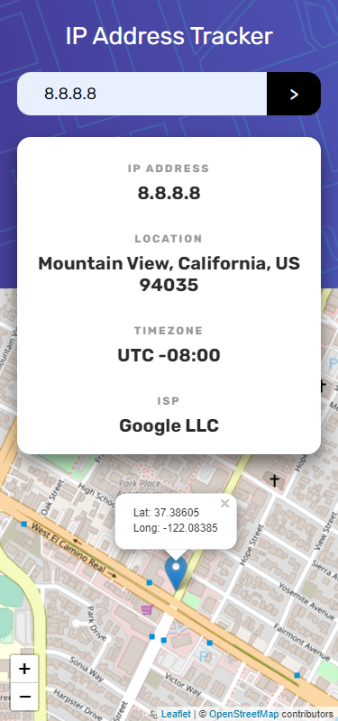
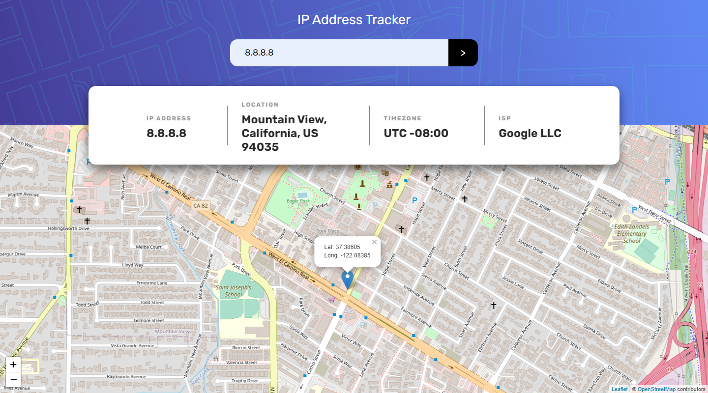

# Frontend Mentor - IP address tracker solution

This is a solution to the [IP address tracker challenge on Frontend Mentor](https://www.frontendmentor.io/challenges/ip-address-tracker-I8-0yYAH0). Frontend Mentor challenges help you improve your coding skills by building realistic projects.

## Table of contents

- [Overview](#overview)
  - [The challenge](#the-challenge)
  - [Screenshot](#screenshot)
  - [Links](#links)
- [My process](#my-process)
  - [Built with](#built-with)
  - [What I learned](#what-i-learned)
  - [Continued development](#continued-development)
  - [Useful resources](#useful-resources)
- [Author](#author)

## Overview

### The challenge

Users should be able to:

- View the optimal layout for each page depending on their device's screen size
- See hover states for all interactive elements on the page
- See their own IP address on the map on the initial page load
- Search for any IP addresses or domains and see the key information and location

### Screenshot

> Mobile Preview
> 

> Desktop Preview
> 

### Links

- Solution URL: [https://github.com/Willwf/ip-address-tracker](https://github.com/Willwf/ip-address-tracker)
- Live Site URL: [https://ip-address-tracker-liart-iota.vercel.app/](https://ip-address-tracker-liart-iota.vercel.app/)

## My process

### Built with

- Semantic HTML5 markup
- CSS custom properties
- Flexbox
- CSS Grid
- Mobile-first workflow
- [React](https://reactjs.org/) - JS library
- [IP Geolocation API](https://geo.ipify.org/) - Real-time IP Geolocation API by ipify
- [LeafletJS](https://leafletjs.com/) - Open-source JavaScript library
  for mobile-friendly interactive maps
- [Styled Components](https://styled-components.com/) - For styles

### What I learned

This one was specially hard for me since it was my first time using a third party API. I've struggled trying to implement good practices and to make it work like I wanted, but I didn't feel quite satisfied. The logic to use the fetch API was challenging enough. I had to watch some videos to implement and I'm still looking for sources that could help me improve on this one. I don't know if I lack knowledge of how React works or something else. But I intend to move on and continue learning about it. Since it was a lot of firsts I spent more time than usual to finish. I had to take a lot of breaks to learn concepts about it.

### Continued development

This project made realize that there is a long way for me. I need to be able to focus more about the other branches of web development like backend.

### Useful resources

- [Env Variables and Modes](https://vitejs.dev/guide/env-and-mode.html) - This helped me to set up and use environment variables on my project using vite template.
- [Como Fazer uma Div preencher a altura restante da tela](https://www.webtutorial.com.br/como-fazer-uma-div-preencher-a-altura-restante-da-tela-distribuindo-o-espaco-automaticamente/) - I've learned better practices of css to make my page more responsible.

## Author

- Github - [William Firmino](https://github.com/Willwf)
- Frontend Mentor - [@Willwf](https://www.frontendmentor.io/profile/Willwf)
- Twitter - [@Williamwf](https://www.twitter.com/Williamwf)
- LinkedIn - [William Firmino](https://www.linkedin.com/in/williamfirmino/)
